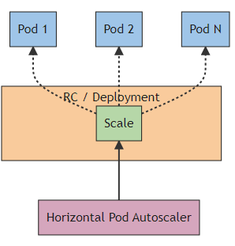

# Docker
Docker is a platform that allows to develop, deploy and run applications inside containers. Containers are lightweight and isolated environments that package an application and its dependencies, making it easy to deploy and run consistently across different environments.  


## How Docker API work
The docker API allows external applications to interact with Docker and manage containers, images, networks and other Docker resources. The Docker Engine API is RESTful API accessed through HTTP requests.

## Comparing Containers and Virtual Machines
Containers and virtual machines are two different technologies used for running and managing applications and services. They have similar benefits but function differently becasue containers virtualise the operating system instead of hardware, making them more portable and efficient. Whereas virtual machines provide stronger isolation and are suitable for legacy applications and complex enviroments.


## How to install Docker on Windows
* [Install docker on windows](https://docs.docker.com/desktop/install/windows-install/)

* `wsl --update` command to update WSL to the latest version
* `docker --version`
  
  


## Create Docker Hub account
[Sign up Docker](https://hub.docker.com/signup?state=hKFo2SBmSkszaWJjME1FTnNsM3dWYjVGV2FGZ0p2ZlF6MF9Pd6Fur3VuaXZlcnNhbC1sb2dpbqN0aWTZIFgwSGVpZjM0ZU00STQydlYydE5jSVdkY1Z5cVNOUnFso2NpZNkgbHZlOUdHbDhKdFNVcm5lUTFFVnVDMGxiakhkaTluYjk)

## Docker Commands

* Display images
  `docker images`

* Display running images
  `docker ps`

* Display all images status
  `docker ps -a`

#### Running nginx image
`docker run -d -p 80:80 nginx`

To make a change on Nginx image
```
docker exec -it 60c1f214d83d sh
```
Nginx image is immutalble so that to make the change to take effect, need to commit the image as a custom image. 

To save the change or commit to docker image
```
docker commit container-id name-of-image
docker commit 60c1f214d83d tech241-parichat-nginx
``` 
To push images to Docker hub
1. login to docker
   ```
   docker login
   ```

2. tag docker image
   ```
   docker tag custom-nginx username/custom-nginx

   docker tag tech241-parichat-nginx parichanket/tech241-parichat-nginx
   ```

3. push the docker image
   ```
   docker push username/custom-nginx

   docker push parichanket/tech241-parichat-nginx
   ```

## Replace nginx default index.html with customed index.html
```
# select the base image
FROM nginx 

# label it
LABEL MAINTAINER=parichat@sparta

# copy index.html from localhost to default nginx index.html location
COPY index.html /usr/share/nginx/html/

# port mapping or exposing the required port: port 80
EXPOSE 80

# command to launch the web server  
CMD ["nginx", "-g", "daemon off;"] 
```

## Copy Sparta app to Docker
1. clone sparta app
   ```
   git clone https://github.com/jungjinggg/tech241_sparta_app.git repo
   ```
2. cd repo and create Dockerfile
   ```
   nano Dockerfile 
   ```
3. inside the editor
   ```
    # Node.js version 12
    FROM node:12

    # Set the working directory inside the container
    WORKDIR /app

    # Copy app folder
    COPY app /app

    # Install node.js dependencies
    RUN npm install

    # Expose the application port
    EXPOSE 3000

    # Command to run the application when the container starts
    CMD ["npm", "start"]
   ```

## Horizontal Pod Autoscaling
HPA is used to autometically updates a workload resource such as Deployment and Statefulset with the aim of autometically scaling the workload to match demand.



